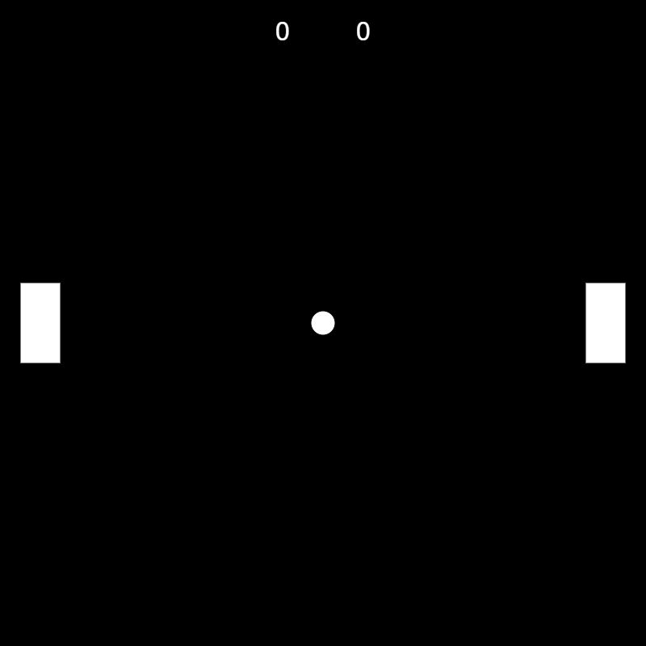

# 🏓 Pong vs Computer

A classic **Ping-Pong** game where you(Pong) challenge a computer opponent, built using **Processing**!

<p align="center">
  
</p>

## 🚀 Features

- Single-player Pong experience against a smart computer
- Real-time paddle movement and ball dynamics
- Score tracking for both player and computer
- Smooth motion with increasing difficulty
- Supports both keyboard and browser-based controls

## 🎮 How to Play

- **Move Up:** `↑` (Up Arrow)  
- **Move Down:** `↓` (Down Arrow)  
- **Start Ball Movement:** `Space Bar`  

The left paddle is controlled by the computer. Deflect the ball using your right paddle and score points when your opponent misses.

## 🛠️ Installation Instructions

### Option 1: Run on Desktop with Processing

#### Requirements

- [**Processing**](https://processing.org/download/) (version 3 or 4 recommended)

#### Steps

1. Download or clone the repository:
   ```bash
   git clone https://github.com/AryanKo/pong-vs-computer.git
